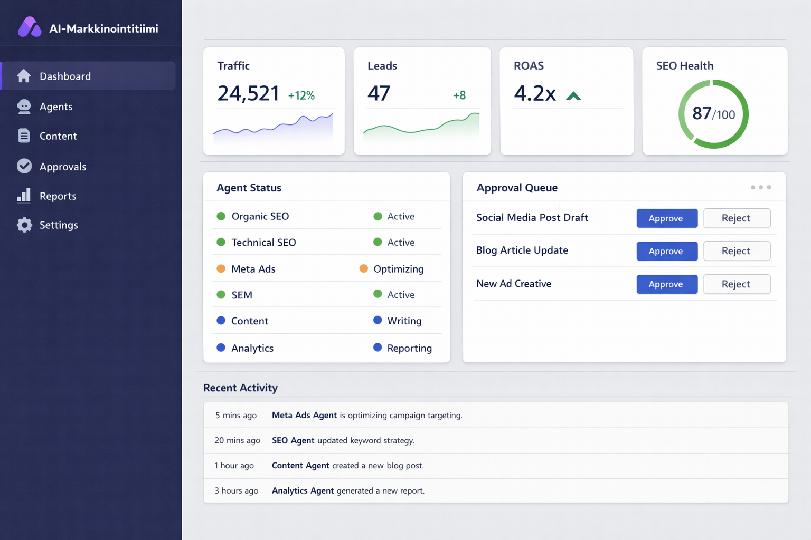
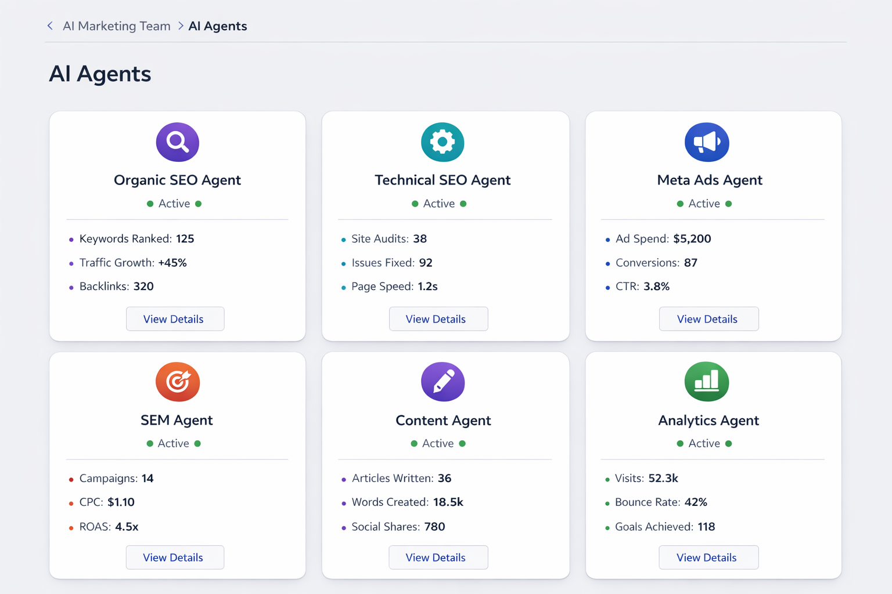
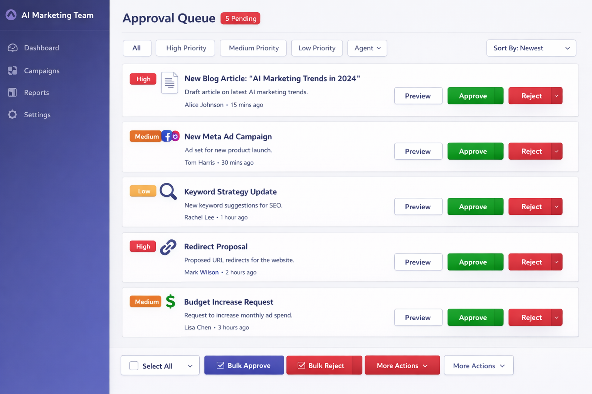
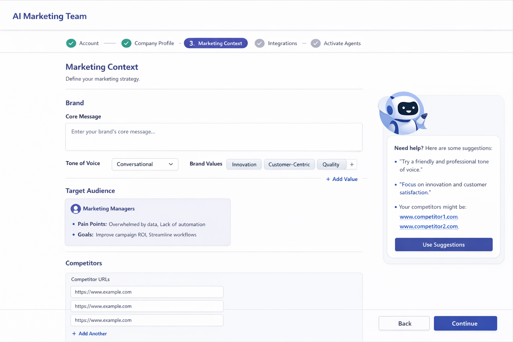

# PRD: AI-Markkinointitiimi

**Versio:** 1.0
**Päivämäärä:** 3.3.2026
**Tekijä:** Aava & Bang AI
**Status:** Draft

---

## Sisällysluettelo

1. [Tuotteen yleiskuvaus](#1-tuotteen-yleiskuvaus)
2. [Kohderyhmä](#2-kohderyhmä)
3. [Asiakkaan onboarding & kontekstin määrittely](#3-asiakkaan-onboarding--kontekstin-määrittely)
4. [AI-agenttimoduulit](#4-ai-agenttimoduulit)
5. [Dashboard & käyttöliittymä](#5-dashboard--käyttöliittymä)
6. [Autonomisuus & työnkulku](#6-autonomisuus--työnkulku)
7. [Tekninen arkkitehtuuri](#7-tekninen-arkkitehtuuri)
8. [Käyttäjätarinat](#8-käyttäjätarinat)
9. [Onnistumismittarit](#9-onnistumismittarit)
10. [Kehityksen vaiheistus](#10-kehityksen-vaiheistus)

---

## UI-konseptikuvat

| Näkymä | Kuva |
|---|---|
| **Dashboard (päänäkymä)** |  |
| **Agenttikortit** |  |
| **Hyväksyntäjono** |  |
| **Onboarding-wizard** |  |

---

## 1. Tuotteen yleiskuvaus

### 1.1 Visio

AI-Markkinointitiimi on SaaS-palvelu, joka korvaa perinteisen markkinointitoimiston autonomisilla AI-agenteilla. Palvelu tarjoaa asiakkaalle kokonaisen markkinointitiimin, joka työskentelee 24/7 — ilman lomia, sairauspoissaoloja tai viestinnän pullonkauloja.

### 1.2 Missio

Demokratisoida laadukas digitaalinen markkinointi tekemällä siitä saavutettavaa jokaiselle yritykselle koosta ja budjetista riippumatta. Poistamme markkinoinnin toteuttamisen suurimman esteen: osaavien tekijöiden puutteen ja korkeat kustannukset.

### 1.3 Arvolupaus

> **"Kokonainen markkinointitiimi — murto-osalla hinnasta, moninkertaisella nopeudella."**

| Perinteinen toimisto | AI-Markkinointitiimi |
|---|---|
| 3 000–15 000 €/kk | 299–999 €/kk |
| Vasteaika 1–5 päivää | Reagoi reaaliajassa |
| 5–10 tuntia/viikko huomiota | 24/7 jatkuva optimointi |
| Raportti kerran kuussa | Reaaliaikainen dashboard |
| Rajoitettu osaaminen | 6 erikoistunutta agenttia |
| Manuaalinen toteutus | Autonominen toteutus + ihmisen hyväksyntä |

### 1.4 Ratkaistava ongelma

**PK-yritykset kohtaavat markkinoinnissa kolme keskeistä ongelmaa:**

1. **Osaajapula** — Osaavia digitaalisen markkinoinnin tekijöitä on vaikea löytää ja kallis palkata. Yhden markkinointiasiantuntijan vuosikustannus on 45 000–65 000 €, eikä yksi henkilö hallitse kaikkia osa-alueita.

2. **Jatkuvan optimoinnin puute** — Markkinointi vaatii jatkuvaa seurantaa, testausta ja optimointia. Toimistomallit perustuvat kuukausipalavereihin ja manuaaliseen raportointiin, jolloin reagointi muutoksiin on hidasta.

3. **Toimiston musta laatikko** — Asiakkaat eivät näe mitä toimisto tekee heidän rahoillaan. Kuukausiraportit ovat usein ympäripyöreitä ja konkreettiset toimenpiteet jäävät epäselviksi.

### 1.5 Tuotteen ydinperiaatteet

- **Läpinäkyvyys** — Asiakas näkee jokaisen toimenpiteen, päätöksen ja tuloksen reaaliajassa
- **Autonomisuus + kontrolli** — Agentit toimivat itsenäisesti mutta kriittiset päätökset vaativat ihmisen hyväksynnän
- **Kontekstitietoisuus** — Agentit ymmärtävät asiakkaan brändin, tavoitteet ja kohderyhmän syvällisesti
- **Jatkuva oppiminen** — Järjestelmä oppii jokaisesta toimenpiteestä ja tuloksesta
- **Mittarit edellä** — Jokainen toimenpide perustuu dataan ja tähtää mitattaviin tuloksiin

---

## 2. Kohderyhmä

### 2.1 Pääkohderyhmät

#### A) PK-yritykset (10–200 henkilöä)
- Ei omaa markkinointitiimiä tai 1–2 henkilön markkinointi
- Budjetti markkinointiin 1 000–10 000 €/kk
- Tarvitsevat tuloksia nopeasti ilman suurta investointia osaamiseen
- **Esimerkki:** SaaS-startup, jolla on 20 työntekijää ja yksi markkinointikoordinaattori

#### B) Markkinointijohtajat ja -päälliköt
- Johtavat pientä markkinointitiimiä (2–5 henkilöä)
- Haluavat laajentaa tiimin kapasiteettia ilman rekrytointeja
- Tarvitsevat erikoisosaamista (SEO, SEM, analytiikka) jota tiimistä puuttuu
- **Esimerkki:** Markkinointipäällikkö, jolla on graafikko ja sisällöntuottaja mutta ei teknistä SEO-osaamista

#### C) Yrittäjät ja soloprenöörit
- Hoitavat markkinointia itse muun työn ohessa
- Haluavat automatisoida ja delegoida markkinointityötä
- Arvostavat yksinkertaisuutta ja tuloskeskeisyyttä
- **Esimerkki:** Konsultti, joka käyttää 3h/viikko markkinointiin ja haluaa skaalata näkyvyyttään

### 2.2 Toimialafokus (MVP)

MVP-vaiheessa keskitymme:
- **B2B-palveluyritykset** (konsultointi, IT-palvelut, lakiasiaintoimistot)
- **B2B SaaS -yritykset**
- **Verkkokaupat** (erityisesti SEO ja maksettu mainonta)

### 2.3 Käyttäjäpersoonat

#### Persona 1: "Markkinointi-Mikko" (PK-yrityksen toimitusjohtaja)
- 42v, johtaa 25 henkilön ohjelmistoyritystä
- Tekee markkinointipäätökset itse, mutta ei ole markkinoinnin ammattilainen
- Haluaa selkeän dashboardin ja konkreettisia toimenpidesuosituksia
- **Kipupiste:** "Maksamme toimistolle 5 000 €/kk enkä tiedä mitä he tekevät"
- **Tavoite:** Ymmärtää mitä markkinoinnissa tapahtuu ja saada mitattavia tuloksia

#### Persona 2: "Strategi-Sanna" (Markkinointipäällikkö)
- 35v, vastaa 3 henkilön markkinointitiimistä kasvuyrityksessä
- Ymmärtää markkinointia syvällisesti mutta tiimin kapasiteetti ei riitä
- Haluaa delegoida rutiinityöt AI:lle ja keskittyä strategiaan
- **Kipupiste:** "Meillä on strategia mutta ei tarpeeksi käsiä toteuttamiseen"
- **Tavoite:** Skaalata tiimin tuottavuutta 3x ilman rekrytointeja

#### Persona 3: "Tekijä-Toni" (Yrittäjä)
- 29v, pyörittää yhden henkilön konsulttiyritystä
- Osaa perusteita mutta tarvitsee apua toteutuksessa
- Haluaa yksinkertaista "laita päälle ja anna mennä" -ratkaisua
- **Kipupiste:** "Tiedän että pitäisi tehdä markkinointia mutta ei ole aikaa"
- **Tavoite:** Säännöllinen markkinointisisältö ja näkyvyys minimivaivalla

---

## 3. Asiakkaan onboarding & kontekstin määrittely

### 3.1 Onboarding-prosessin yleiskuvaus

> **UI-konseptikuva:** 

Onboarding on kriittinen vaihe, jossa rakennetaan AI-agenttien toimintakonteksti. Prosessi on suunniteltu olemaan nopeasti läpikäytävissä (30–60 min) mutta riittävän kattava laadukkaan toiminnan varmistamiseksi.

```
┌─────────────┐    ┌──────────────┐    ┌────────────────┐    ┌──────────────┐    ┌─────────────┐
│  1. Rekis-   │───▶│  2. Yritys-   │───▶│  3. Markkinoin-│───▶│  4. Integraa- │───▶│  5. Agentti- │
│  töityminen  │    │  profiili     │    │  tikonteksti   │    │  tiot         │    │  aktivointi  │
└─────────────┘    └──────────────┘    └────────────────┘    └──────────────┘    └─────────────┘
```

### 3.2 Vaihe 1: Rekisteröityminen
- Sähköposti + salasana tai Google SSO
- Yrityksen nimi ja verkkosivuston URL
- Tilaustason valinta (voi muuttaa myöhemmin)

### 3.3 Vaihe 2: Yritysprofiili

**Automaattisesti kerättävä data:**
- Verkkosivuston rakenteen skannaus (sitemap, sivurakenne)
- Nykyinen SEO-tila (avainsanapositiot, tekniset ongelmat)
- Sosiaalisen median profiilien tunnistus
- Kilpailijoiden alustava tunnistus

**Asiakkaalta kysyttävä data:**
| Kenttä | Kuvaus | Esimerkki |
|---|---|---|
| Yrityksen kuvaus | Vapaamuotoinen kuvaus liiketoiminnasta | "Tarjoamme pilvipalveluratkaisuja PK-yrityksille" |
| Toimiala | Valinta toimialaluokittelusta + vapaa teksti | IT-palvelut > Pilvipalvelut |
| Yrityksen koko | Henkilömäärä ja liikevaihto | 15 hlö, 2M € |
| Maantieteellinen fokus | Kohdemarkkinat | Suomi, Ruotsi, Norja |
| Palvelukielet | Missä kielissä toimitaan | Suomi, Englanti |

### 3.4 Vaihe 3: Markkinointikonteksti

**Brändi & ääni:**
| Kenttä | Kuvaus |
|---|---|
| Brändin ydinviesti | Mitä brändi haluaa kommunikoida |
| Tone of Voice | Virallinen / rento / asiantunteva / leikkisä |
| Brändin arvot | 3–5 keskeistä arvoa |
| Erottautumistekijät | Miksi asiakas valitsee meidät kilpailijan sijaan |
| Brändiopas (upload) | PDF/linkki brändiohjeistukseen |

**Kohderyhmät:**
- Vähintään 1, enintään 5 kohderyhmäprofiilia
- Jokaisesta: rooli, kipupisteet, tavoitteet, kanavat, päätöksentekokriteerit
- AI ehdottaa kohderyhmäprofiileja verkkosivuston ja toimialan perusteella

**Kilpailijat:**
- 3–5 pääkilpailijaa (URL:t)
- AI analysoi automaattisesti kilpailijoiden markkinoinnin, avainsanat ja sisältöstrategian

**Tavoitteet:**
| Tavoitetyyppi | Esimerkki |
|---|---|
| Liikennetavoite | +50% orgaanista liikennettä 6kk:ssa |
| Liidien generointi | 50 kvalifioitua liidiä/kk |
| Bränditietoisuus | 10 000 sosiaalisen median seuraajaa |
| Konversiotavoite | 3% konversioaste landing pageilta |

### 3.5 Vaihe 4: Integraatiot

**Pakolliset integraatiot:**
- Google Analytics 4 (GA4)
- Google Search Console

**Suositellut integraatiot:**
- Google Ads -tili
- Meta Business Suite (Facebook/Instagram)
- CMS-yhteys (WordPress, Webflow, Shopify)
- CRM-yhteys (HubSpot, Pipedrive, Salesforce)

**Valinnaiset integraatiot:**
- LinkedIn Ads
- Mailchimp / ActiveCampaign
- Slack (notifikaatioille)

### 3.6 Vaihe 5: Agenttien aktivointi

- Alkuanalyysi (15–30 min): Agentit analysoivat kerätyn datan
- Ensimmäiset suositukset: Lista konkreettisista toimenpiteistä
- Asiakkaan hyväksyntä: Asiakas käy läpi ja hyväksyy/hylkää ehdotukset
- Toiminta alkaa: Agentit aloittavat hyväksyttyjen toimenpiteiden toteuttamisen

---

## 4. AI-agenttimoduulit

Järjestelmä koostuu kuudesta erikoistuneesta AI-agentista, jotka toimivat koordinoidusti mutta itsenäisesti. Kukin agentti hallitsee oman osa-alueensa ja kommunikoi muiden agenttien kanssa jaetun kontekstin kautta.

### 4.1 Orgaaninen SEO -agentti

**Rooli:** Orgaanisen hakukonenäkyvyyden strateginen optimointi ja sisältösuunnittelu.

**Vastuualueet:**

| Toiminto | Kuvaus | Tiheys |
|---|---|---|
| Avainsanatutkimus | Löytää ja priorisoi uudet avainsanamahdollisuudet | Jatkuva |
| Sisältösuunnittelu | Luo SEO-optimoituja sisältöbriefejä | Viikottain |
| Kilpailija-analyysi | Seuraa kilpailijoiden avainsanapositioita ja sisältöä | Päivittäin |
| Sisäinen linkitys | Analysoi ja ehdottaa sisäisiä linkkejä | Kuukausittain |
| Positioiden seuranta | Seuraa avainsanojen sijoituksia hakukoneissa | Päivittäin |
| Sisältöaukkojäanalyysi | Tunnistaa puuttuvat sisältöteemat | Kuukausittain |

**Tuotokset:**
- Avainsanaraportit ja -klusterit
- Sisältökalenteriehdotukset
- Sisältöbriefit (otsikko, meta-kuvaus, otsikkorakenne, avainsanat, sisäiset linkit)
- Kuukausittaiset SEO-suorituskatsaukset

**Hyväksyntäprosessi:**
- Uudet avainsanastrategiat → asiakkaan hyväksyntä
- Sisältöbriefien lähettäminen tuotantoon → asiakkaan hyväksyntä
- Sisäiset linkitysmuutokset → automaattinen (matala riski)
- Positioiden seuranta ja raportointi → automaattinen

**Käytetyt datalähteet:**
- Google Search Console (positiot, klikkaukset, impressiot)
- Google Analytics 4 (orgaaninen liikenne, konversiot)
- Kolmannen osapuolen SEO-työkalut (Ahrefs API / SEMrush API)
- Kilpailijoiden verkkosivustot (sisältöanalyysi)

---

### 4.2 Tekninen SEO -agentti

**Rooli:** Verkkosivuston teknisen SEO-terveyden ylläpito ja optimointi.

**Vastuualueet:**

| Toiminto | Kuvaus | Tiheys |
|---|---|---|
| Sivuston crawlaus | Systemaattinen sivuston tekninen tarkistus | Viikottain |
| Core Web Vitals | Suorituskykymittareiden seuranta (LCP, INP, CLS) | Päivittäin |
| Indeksointiongelmat | Tunnistaa ja korjaa indeksointiesteet | Jatkuva |
| Rakenteellinen data | Schema.org -merkintöjen validointi ja ehdotukset | Kuukausittain |
| Sivukartat | XML-sivukarttojen ylläpito ja optimointi | Automaattinen |
| Mobiiliystävällisyys | Mobiilioptimoinnin tarkistus | Viikottain |
| Sivun nopeusoptimointi | Kuvien, CSS:n ja JS:n optimointiehdotukset | Kuukausittain |

**Tuotokset:**
- Tekninen SEO -audit raportti (priorisoidut ongelmat)
- Automaattiset korjausehdotukset (meta-tagit, redirectit, robots.txt)
- Core Web Vitals -dashboard
- Rakenteellisen datan ehdotukset
- Sivuston terveysraportti (trendi)

**Hyväksyntäprosessi:**
- Robots.txt ja sitemap-muutokset → automaattinen
- Redirect-ehdotukset → asiakkaan hyväksyntä
- Meta-tag -muutokset → automaattinen (matala riski) / hyväksyntä (suuri muutos)
- Rakenteellisen datan implementointi → asiakkaan hyväksyntä
- Korjausehdotukset kolmannelle osapuolelle → raportti asiakkaalle

**Käytetyt datalähteet:**
- Google Search Console (indeksointistatus, Core Web Vitals)
- Sivuston crawlaus (oma crawler)
- Google PageSpeed Insights API
- Schema.org -validaattorit

---

### 4.3 Maksettu some -agentti (Meta Ads)

**Rooli:** Meta (Facebook & Instagram) -mainoskampanjoiden hallinta ja optimointi.

**Vastuualueet:**

| Toiminto | Kuvaus | Tiheys |
|---|---|---|
| Kampanjarakenne | Kampanjoiden luominen ja rakenteen optimointi | Tarpeen mukaan |
| Yleisöjen hallinta | Kohdeyleisöjen luominen ja testaaminen | Viikottain |
| Mainosten luominen | Mainostekstien ja visuaalisten elementtien tuotanto | Viikottain |
| A/B-testaus | Mainosten, yleisöjen ja sijoittelujen testaaminen | Jatkuva |
| Budjetin optimointi | Budjetin allokointi parhaiten suoriutuville kampanjoille | Päivittäin |
| Raportointi | Kampanjasuorituskyvyn seuranta ja analysointi | Päivittäin |

**Tuotokset:**
- Kampanjaehdotukset (tavoite, yleisö, budjetti, aikataulu)
- Mainostekstit ja kuvatekstiehdotukset (3–5 versiota per mainos)
- Yleisösuositukset (lookalike, interest-based, retargeting)
- Viikottainen kampanjaoptimointiraportti
- Kuukausittainen ROI-analyysi

**Hyväksyntäprosessi:**
- Uusien kampanjoiden käynnistys → asiakkaan hyväksyntä
- Mainostekstit ja -materiaalit → asiakkaan hyväksyntä
- Budjetin kasvattaminen yli 20% → asiakkaan hyväksyntä
- Yleisöjen A/B-testaus → automaattinen
- Budjetin uudelleenallokointi (alle 20%) → automaattinen
- Huonosti suoriutuvien mainosten pysäyttäminen → automaattinen

**Käytetyt datalähteet:**
- Meta Ads API (kampanjadata, mainosten suorituskyky)
- Meta Pixel / Conversions API (konversioseuranta)
- Google Analytics 4 (cross-platform -attribuutio)

**Mainosten luontiprosessi:**
```
1. Agentti analysoi kohderyhmän ja kampanjatavoitteen
2. Generoi 3-5 mainostekstivaihtoehtoa
3. Ehdottaa visuaalista suuntaa (moodboard + ohjeistus)
4. Lähettää hyväksyttäväksi asiakkaalle
5. Hyväksynnän jälkeen julkaisee ja aloittaa A/B-testauksen
6. Optimoi automaattisesti voittajien perusteella
```

---

### 4.4 SEM-agentti (Google Ads)

**Rooli:** Google Ads -kampanjoiden hallinta, optimointi ja skaalaus.

**Vastuualueet:**

| Toiminto | Kuvaus | Tiheys |
|---|---|---|
| Avainsanastrategia | Avainsanojen tutkimus, valinta ja negatiiviset avainsanat | Viikottain |
| Kampanjarakenne | Search, Display, Performance Max -kampanjoiden rakentaminen | Tarpeen mukaan |
| Mainostekstit | RSA-mainosten tekstien luominen ja optimointi | Viikottain |
| Hintatarjousten hallinta | Bid strategy -optimointi ja manuaaliset säädöt | Päivittäin |
| Quality Score | Laatupisteiden seuranta ja parantaminen | Viikottain |
| Laskeutumissivut | Landing page -ehdotukset ja optimointi | Kuukausittain |

**Tuotokset:**
- Avainsanalistat (ryhmiteltyinä kampanjarakenteen mukaan)
- RSA-mainostekstit (otsikot 15 kpl, kuvaukset 4 kpl per mainosryhmä)
- Negatiivisten avainsanojen listat
- Kampanjarakennesuositukset
- Viikottainen optimointiraportti
- Kuukausittainen budjetti-analyysi ja -suositukset

**Hyväksyntäprosessi:**
- Uusien kampanjoiden luominen → asiakkaan hyväksyntä
- Päiväbudjetin kasvattaminen yli 20% → asiakkaan hyväksyntä
- Uudet avainsanaryhmät → asiakkaan hyväksyntä
- Mainostekstien A/B-testaus → automaattinen
- Negatiivisten avainsanojen lisäys → automaattinen
- Bid-strategian hienosäätö → automaattinen

**Käytetyt datalähteet:**
- Google Ads API (kampanjadata, avainsanat, laatupisteet)
- Google Keyword Planner (avainsanatutkimus)
- Google Analytics 4 (konversiot, käyttäjäpolut)
- Google Search Console (orgaaninen data ristiin verrattuna)

---

### 4.5 Sisältöagentti

**Rooli:** Laadukkaan markkinointisisällön tuotanto kaikille kanaville.

**Vastuualueet:**

| Toiminto | Kuvaus | Tiheys |
|---|---|---|
| Blogiartikkelit | SEO-optimoitujen artikkelien kirjoittaminen | 2–4 kpl/viikko |
| Sosiaalinen media | LinkedIn-, Facebook-, Instagram-postaukset | Päivittäin |
| Sähköpostimarkkinointi | Uutiskirjeet ja automaatioviestit | Viikottain |
| Landing paget | Laskeutumissivujen tekstisisältö | Tarpeen mukaan |
| Mainostekstit | Tuki maksettu some- ja SEM-agenteille | Tarpeen mukaan |
| Sisällön lokalisointi | Sisällön kääntäminen ja lokalisointi | Tarpeen mukaan |

**Tuotokset:**
- Blogiartikkelit (1 000–2 500 sanaa, SEO-optimoitu)
- Sosiaalisen median sisältökalenteri (2–4 viikon ennakkoon)
- Sähköpostimarkkinoinnin sekvenssit
- Landing page -kopiot
- Sisältöbriefien toteutukset

**Sisällöntuotantoprosessi:**
```
1. Vastaanottaa sisältöbrief SEO-agentilta TAI luo oman sisältöidean
2. Tutkii aiheesta (kilpailijoiden sisältö, hakuintentio, lähteet)
3. Luo ensimmäisen luonnoksen
4. Optimoi SEO-signaalien perusteella (avainsanat, rakenne, sisäiset linkit)
5. Lähettää asiakkaan hyväksyttäväksi
6. Tekee asiakkaan pyytämät muutokset
7. Julkaisee hyväksynnän jälkeen (CMS-integraation kautta)
```

**Hyväksyntäprosessi:**
- Blogiartikkelit → asiakkaan hyväksyntä aina
- Sosiaalisen median postaukset → asiakkaan hyväksyntä (voidaan asettaa auto-hyväksyntä)
- Sähköpostikampanjat → asiakkaan hyväksyntä aina
- Landing page -sisältö → asiakkaan hyväksyntä aina
- Sisällön pienet muokkaukset (kirjoitusvirheet, linkit) → automaattinen

**Laadunvarmistus:**
- Plagiaatin tarkistus
- Brändi-äänensävyn noudattaminen (vertailu brändioppaaseen)
- SEO-optimoinnin tarkistus (avainsanatiheys, rakenne, meta-tiedot)
- Kielioppi- ja oikeellisuustarkistus
- Faktojen tarkistus (lähdeviittaukset)

---

### 4.6 Analytiikka & raportointi -agentti

**Rooli:** Kaiken markkinointidatan kerääminen, analysointi ja raportointi yhdessä paikassa.

**Vastuualueet:**

| Toiminto | Kuvaus | Tiheys |
|---|---|---|
| Data-aggregointi | Kaikkien kanavien datan kerääminen ja yhtenäistäminen | Reaaliaikainen |
| Trendien tunnistus | Poikkeamien ja trendien havaitseminen | Päivittäin |
| Attribuutiomallinnus | Konversioiden attribuointi eri kanaville | Viikottain |
| Automaattinen raportointi | Viikko- ja kuukausiraporttien generointi | Ajoitettu |
| Ennustemallinnus | Tulevien tulosten ennustaminen historiadatan perusteella | Kuukausittain |
| Anomalioiden havaitseminen | Poikkeuksellisten muutosten tunnistus ja hälytykset | Reaaliaikainen |

**Tuotokset:**
- **Reaaliaikainen dashboard:** Keskeiset mittarit yhdessä näkymässä
- **Viikkoraportti:** Tiivistelmä viikon tapahtumista, trendeistä ja toimenpiteistä
- **Kuukausiraportti:** Kattava katsaus kaikilla mittareilla, vertailu edelliseen kuukauteen ja tavoitteisiin
- **Hälytykset:** Reaaliaikaiset ilmoitukset merkittävistä muutoksista (liikennepiikki/-pudotus, kampanjaongelmat, tekniset virheet)
- **Ennusteet:** Tulevaisuuden skenaariot eri budjettitasoilla
- **Toimenpidesuositukset:** Data-pohjaiset suositukset muille agenteille

**Raporttien sisältörakenne:**
```
┌─ Kuukausiraportti ─────────────────────────────────┐
│                                                      │
│  1. Yhteenveto (Executive Summary)                   │
│     - Top 3 onnistumista                             │
│     - Top 3 kehityskohdetta                          │
│     - ROI-yhteenveto                                 │
│                                                      │
│  2. Kanavakatsaus                                    │
│     - Orgaaninen haku (SEO)                          │
│     - Maksettu haku (SEM)                            │
│     - Sosiaalinen media (orgaaninen + maksettu)      │
│     - Sähköpostimarkkinointi                         │
│                                                      │
│  3. Tavoitteiden seuranta                            │
│     - KPI-vertailu tavoitteisiin                     │
│     - Trendikaavio (6kk)                             │
│                                                      │
│  4. Toimenpiteet                                     │
│     - Tehdyt toimenpiteet (lista)                    │
│     - Suunnitellut toimenpiteet (seuraava kk)        │
│                                                      │
│  5. Suositukset                                      │
│     - Budjettiallokaatio                             │
│     - Sisältöprioriteetit                            │
│     - Tekniset korjaukset                            │
│                                                      │
└──────────────────────────────────────────────────────┘
```

**Käytetyt datalähteet:**
- Google Analytics 4 (kaikki kanavat)
- Google Search Console (orgaaninen haku)
- Google Ads API (SEM-data)
- Meta Ads API (some-mainonta)
- CMS-data (sisältöanalyysi)
- CRM-data (liidien seuranta, myyntiputki)

---

### 4.7 Agenttien välinen kommunikaatio

Agentit eivät toimi eristyksissä vaan jakavat kontekstin ja koordinoivat toimintaansa.

**Kommunikaatiomatriisi:**

| Lähettäjä | Vastaanottaja | Viestityyppi | Esimerkki |
|---|---|---|---|
| Orgaaninen SEO | Sisältöagentti | Sisältöbrief | "Tarvitaan artikkeli aiheesta X, avainsanat Y" |
| Orgaaninen SEO | Tekninen SEO | Tekninen pyyntö | "Sivulle X tarvitaan schema-merkinnät" |
| Tekninen SEO | Orgaaninen SEO | Tekninen raportti | "Sivun X latausnopeus pudottanut positioita" |
| Analytiikka | Kaikki agentit | Data-insight | "Kanava X performanssissa trendi alaspäin" |
| SEM-agentti | Sisältöagentti | Landing page -pyyntö | "Tarvitaan landing page kampanjalle X" |
| Maksettu some | Sisältöagentti | Mainosmateriaalipyyntö | "Tarvitaan 3 mainostekstiä kohderyhmälle X" |
| Sisältöagentti | Orgaaninen SEO | Julkaisuilmoitus | "Artikkeli X julkaistu, sisäinen linkitys?" |

**Orkestroinnin periaatteet:**
1. **Analytiikka-agentti on johtaja** — Se jakaa datapohjaiset insightit muille agenteille
2. **Orgaaninen SEO ohjaa sisältöä** — Sisältöagentti tuottaa SEO-agentin ohjaamana
3. **Budjettipäätökset keskitetysti** — Maksettu some ja SEM koordinoivat budjetinallokaatiota
4. **Ristiriitatilanteessa analytiikka ratkaisee** — Data voittaa aina mielipiteet

---

## 5. Dashboard & käyttöliittymä

### 5.1 Päänäkymä (Dashboard)

Dashboard on palvelun sydän. Se tarjoaa kokonaiskuvan markkinoinnin tilasta yhdellä silmäyksellä.

> **UI-konseptikuva:** 

**Layout-rakenne:**

```
┌──────────────────────────────────────────────────────────────────┐
│  🏠 AI-Markkinointitiimi          [Haku]  [Ilmoitukset] [Profiili] │
├────────┬─────────────────────────────────────────────────────────┤
│        │                                                          │
│  NAV   │  ┌─────────────────────────────────────────────────┐    │
│        │  │           YHTEENVETO-KORTIT                      │    │
│ Dash-  │  │  [Liikenne ▲12%] [Liidit +8] [ROAS 4.2x] [SEO]│    │
│ board  │  └─────────────────────────────────────────────────┘    │
│        │                                                          │
│ Agen-  │  ┌─────────────────────┐ ┌──────────────────────────┐  │
│ tit    │  │   AGENTTIEN STATUS   │ │  HYVÄKSYNTÄJONO          │  │
│        │  │                      │ │                           │  │
│ Sisäl- │  │ ✅ Org. SEO  Aktiivi │ │ 📝 Blogiartikkeli "X"    │  │
│ töt    │  │ ✅ Tekn. SEO Aktiivi │ │ 📣 Meta-mainos kampanja  │  │
│        │  │ ⚡ Meta Ads  Optim.  │ │ 🔍 Uudet avainsanat      │  │
│ Rapor- │  │ ✅ SEM      Aktiivi  │ │                           │  │
│ tit    │  │ 📝 Sisältö  Kirjoit.│ │ [Hyväksy kaikki]          │  │
│        │  │ 📊 Analyt.  Raportti│ │                           │  │
│ Asetuk-│  └─────────────────────┘ └──────────────────────────┘  │
│ set    │                                                          │
│        │  ┌──────────────────────────────────────────────────┐   │
│        │  │            AKTIVITEETTISYÖTE                       │   │
│        │  │                                                    │   │
│        │  │ 14:32 🔍 SEO-agentti löysi 12 uutta avainsanaa   │   │
│        │  │ 14:15 📝 Sisältöagentti julkaisi artikkelin       │   │
│        │  │ 13:58 ⚡ Meta Ads optimoi kampanjan budjettia     │   │
│        │  │ 13:30 📊 Viikkoraportti valmis                    │   │
│        │  │ 12:45 ⚠️ Tekninen SEO havaitsi 3 rikkinäistä...  │   │
│        │  │                                                    │   │
│        │  └──────────────────────────────────────────────────┘   │
│        │                                                          │
├────────┴─────────────────────────────────────────────────────────┤
│  © Aava & Bang AI 2026                                            │
└──────────────────────────────────────────────────────────────────┘
```

### 5.2 Yhteenveto-kortit

Neljä päämetriikkaa ylänäkymässä:

| Kortti | Mittari | Visualisointi |
|---|---|---|
| **Liikenne** | Kokonaissivuvierailut (30pv) | Sparkline + muutosprosentti |
| **Liidit** | Generoidut liidit (30pv) | Luku + trendi |
| **ROAS** | Return on Ad Spend | Luku + vertailu edelliseen kauteen |
| **SEO Health** | Kokonais-SEO-terveyspistemäärä (0–100) | Ympyräkaavio + muutos |

### 5.3 Agenttikortit

> **UI-konseptikuva:** 

Jokainen agentti esitetään omana korttinaan, joka näyttää:

```
┌─────────────────────────────────────┐
│  🔍 Orgaaninen SEO -agentti         │
│                                      │
│  Status: ● Aktiivinen               │
│  Viimeisin toiminto: 5 min sitten    │
│                                      │
│  📊 Viikon tulokset:                │
│  • Positiot nousseet: 23 kpl         │
│  • Uudet avainsanat: 12 kpl         │
│  • Orgaaninen liikenne: +8%          │
│                                      │
│  🔔 Odottaa hyväksyntää: 2 kpl      │
│                                      │
│  [Näytä lisää]  [Agenttiasetukset]  │
└─────────────────────────────────────┘
```

**Statukset:**
- 🟢 **Aktiivinen** — Agentti toimii normaalisti
- 🔵 **Analysoi** — Agentti käsittelee dataa
- 🟡 **Odottaa** — Odottaa asiakkaan hyväksyntää
- 🟠 **Optimoi** — Suorittaa optimointitoimenpidettä
- 🔴 **Pysäytetty** — Asiakas pysäyttänyt agentin
- ⚪ **Ei käytössä** — Agentti ei ole tilauksessa

### 5.4 Aktiviteettisyöte

Kronologinen lista agenttien toimenpiteistä:

- **Aikaleima** — Milloin toimenpide tapahtui
- **Agentti-ikoni** — Mikä agentti teki toimenpiteen
- **Toimenpidekuvaus** — Mitä tehtiin
- **Tulos/status** — Mitä saatiin aikaan
- **Toimintopainike** — Linkki yksityiskohtiin tai hyväksyntänäkymään

Syötettä voi suodattaa agenteittain, toimenpidetyypeittäin ja aikavälillä.

### 5.5 Hyväksyntätyönkulku (Approval Queue)

> **UI-konseptikuva:** 

Keskitetty näkymä kaikista odottavista hyväksynnöistä:

```
┌──────────────────────────────────────────────────────────────┐
│  HYVÄKSYNTÄJONO (5 odottavaa)                                │
│                                                               │
│  ┌─── Korkea prioriteetti ────────────────────────────────┐  │
│  │ 📝 Blogiartikkeli: "10 tapaa parantaa B2B-myyntiä"     │  │
│  │    Agentti: Sisältöagentti | Luotu: 2h sitten           │  │
│  │    [Esikatsele] [Muokkaa] [Hyväksy ✓] [Hylkää ✗]      │  │
│  └────────────────────────────────────────────────────────┘  │
│                                                               │
│  ┌─── Normaali prioriteetti ──────────────────────────────┐  │
│  │ 📣 Meta-mainoskampanja: "Kevät 2026 Lead Gen"          │  │
│  │    Agentti: Maksettu some | Budjetti: 500€/pv           │  │
│  │    [Esikatsele] [Muokkaa] [Hyväksy ✓] [Hylkää ✗]      │  │
│  ├────────────────────────────────────────────────────────┤  │
│  │ 🔍 Uusi avainsanastrategia: "pilvipalvelut" -klusteri  │  │
│  │    Agentti: Orgaaninen SEO | Avainsanoja: 35 kpl        │  │
│  │    [Tarkastele] [Hyväksy ✓] [Hylkää ✗]                 │  │
│  ├────────────────────────────────────────────────────────┤  │
│  │ 🔧 Redirect-ehdotus: 5 sivua → uudet URLit             │  │
│  │    Agentti: Tekninen SEO | Vaikutus: Keskisuuri          │  │
│  │    [Tarkastele] [Hyväksy ✓] [Hylkää ✗]                 │  │
│  ├────────────────────────────────────────────────────────┤  │
│  │ 💰 Google Ads budjetin nosto: 50€/pv → 75€/pv          │  │
│  │    Agentti: SEM | Syy: +32% konversiot viime viikolla   │  │
│  │    [Tarkastele] [Hyväksy ✓] [Hylkää ✗]                 │  │
│  └────────────────────────────────────────────────────────┘  │
│                                                               │
│  [Hyväksy kaikki normaalit] [Hyväksy kaikki]                 │
└──────────────────────────────────────────────────────────────┘
```

**Hyväksyntänäkymän ominaisuudet:**
- Esikatselu: Näe valmis sisältö/kampanja ennen hyväksyntää
- Muokkaus: Tee pieniä muutoksia ennen hyväksyntää
- Palaute: Hylkäys + palautekenttä ("Muuta otsikkoa → ...") → agentti korjaa
- Massakäsittely: Hyväksy useita kerralla
- Prioriteetti: Korkea/normaali/matala
- Deadline: Ehdotettu julkaisuajankohta

### 5.6 Agentin yksityiskohtanäkymä

Jokaisella agentilla on oma syväluotausnäkymä:

```
┌──────────────────────────────────────────────────────────────┐
│  🔍 Orgaaninen SEO -agentti                    [⚙️ Asetukset]│
│                                                               │
│  ┌── Agenttitila ────┐  ┌── Viikon KPI:t ──────────────┐    │
│  │ Status: Aktiivinen│  │ Positiot ▲ : 23              │    │
│  │ Toimenpiteet: 47   │  │ Positiot ▼ : 5               │    │
│  │ Odottaa: 2         │  │ Uudet avainsanat: 12         │    │
│  └───────────────────┘  │ Org. liikenne: +8.2%          │    │
│                          └─────────────────────────────┘    │
│                                                               │
│  ┌── Avainsanapositiot (Top 20) ─────────────────────────┐   │
│  │  [Kaavio: positiokehitys viimeisen 30pv aikana]        │   │
│  └────────────────────────────────────────────────────────┘   │
│                                                               │
│  ┌── Viimeisimmät toimenpiteet ───────────────────────────┐   │
│  │ • Avainsanatutkimus: "SaaS-markkinointi" -klusteri     │   │
│  │ • Sisältöbrief: "B2B-markkinoinnin trendit 2026"       │   │
│  │ • Kilpailija-analyysi: Competitor X uusi sisältö       │   │
│  └────────────────────────────────────────────────────────┘   │
│                                                               │
│  ┌── Agentin lokikirja ──────────────────────────────────┐   │
│  │ [Yksityiskohtainen loki kaikista agentin päätöksistä   │   │
│  │  ja toimenpiteistä, aikaleimoineen]                     │   │
│  └────────────────────────────────────────────────────────┘   │
└──────────────────────────────────────────────────────────────┘
```

### 5.7 Navigaatiorakenne

```
📊 Dashboard (päänäkymä)
├── 🤖 Agentit
│   ├── Orgaaninen SEO
│   ├── Tekninen SEO
│   ├── Maksettu some (Meta Ads)
│   ├── SEM (Google Ads)
│   ├── Sisältö
│   └── Analytiikka & raportointi
├── 📝 Sisällöt
│   ├── Blogiartikkelit
│   ├── Sosiaalinen media
│   ├── Sähköpostimarkkinointi
│   └── Landing paget
├── ✅ Hyväksynnät
├── 📈 Raportit
│   ├── Viikkoraportit
│   ├── Kuukausiraportit
│   └── Mukautetut raportit
├── 🔔 Ilmoitukset
└── ⚙️ Asetukset
    ├── Yritysprofiili
    ├── Integraatiot
    ├── Tiimin hallinta
    ├── Agenttiasetukset
    └── Laskutus
```

---

## 6. Autonomisuus & työnkulku

### 6.1 Autonomisuustasot

Jokaiselle agenttitoiminnolle on määritelty autonomisuustaso:

| Taso | Kuvaus | Esimerkki |
|---|---|---|
| **Täysin autonominen** | Agentti toimii ilman ihmisen puuttumista | Positioiden seuranta, raporttien generointi |
| **Ilmoitus jälkikäteen** | Agentti tekee ja ilmoittaa asiakkaalle | A/B-testin käynnistys, budjetin pieni siirto |
| **Hyväksyntä etukäteen** | Agentti ehdottaa ja odottaa hyväksyntää | Sisällön julkaisu, kampanjan käynnistys |
| **Yhteistyö** | Agentti ja asiakas työskentelevät yhdessä | Strategian muutos, brändiohjeistuksen päivitys |

### 6.2 Oletusautonomiatasot agenteittain

| Toiminto | Orgaaninen SEO | Tekninen SEO | Meta Ads | SEM | Sisältö | Analytiikka |
|---|---|---|---|---|---|---|
| Analyysi & monitorointi | Autonominen | Autonominen | Autonominen | Autonominen | Autonominen | Autonominen |
| Raportointi | Autonominen | Autonominen | Autonominen | Autonominen | Autonominen | Autonominen |
| Pienet optimoinnit | Ilmoitus | Autonominen | Ilmoitus | Ilmoitus | — | — |
| Sisällön tuotanto | — | — | Hyväksyntä | Hyväksyntä | Hyväksyntä | — |
| Kampanja/strategia muutokset | Hyväksyntä | Hyväksyntä | Hyväksyntä | Hyväksyntä | Hyväksyntä | — |
| Budjettimuutokset (>20%) | — | — | Hyväksyntä | Hyväksyntä | — | — |

**Asiakas voi mukauttaa tasoja:** Kokeneet käyttäjät voivat nostaa autonomiatasoja (esim. "julkaise sosiaalisen median sisältö automaattisesti") tai laskea niitä (esim. "kysy aina ennen minkään muutoksen tekemistä").

### 6.3 Päivittäinen toimintasykli

```
┌─────────── AAMUN ANALYYSI (06:00) ────────────┐
│                                                  │
│  1. Analytiikka-agentti kerää yön datan          │
│  2. Tunnistaa merkittävät muutokset              │
│  3. Jakaa insightit muille agenteille            │
│                                                  │
├─────────── AAMUPÄIVÄN TOIMINTA (08:00-12:00) ──┤
│                                                  │
│  4. Agentit suunnittelevat päivän toimenpiteet   │
│  5. Autonomiset toimenpiteet toteutetaan          │
│  6. Hyväksyntää vaativat lähetetään jonoon        │
│                                                  │
├─────────── ILTAPÄIVÄN OPTIMOINTI (12:00-18:00) ─┤
│                                                  │
│  7. Maksetun mainonnan reaaliaikainen optimointi  │
│  8. Sisällön julkaisu (hyväksytyistä)            │
│  9. A/B-testien seuranta                          │
│                                                  │
├─────────── ILLAN RAPORTOINTI (18:00-22:00) ─────┤
│                                                  │
│  10. Päivän yhteenveto                            │
│  11. Huomisen prioriteetit                        │
│  12. Viikkoraportin päivitys (pe)                │
│                                                  │
└──────────────────────────────────────────────────┘
```

### 6.4 Hyväksyntäprosessin yksityiskohdat

**Hyväksyntäpyynnön elinkaari:**

```
Agentti luo ehdotuksen
        │
        ▼
[ODOTTAA HYVÄKSYNTÄÄ]
        │
   ┌────┼────┐
   ▼    ▼    ▼
 Hyväk- Hylä- Muok-
 syntä  tty   kaus
   │    │      │
   ▼    ▼      ▼
Toteu- Agent- Agentti
tetaan ti op-  tekee
       pii &  muutok-
       ehdot- set →
       taa    uusi
       uutta  hyväk-
              syntä
```

**Hyväksyntäajan hallinta:**
- Oletusaika: 48h (toimenpide toteutetaan automaattisesti jos ei vastausta)
- Kiireelliset: 4h (esim. kampanjabudjetti loppumassa)
- Asiakas voi mukauttaa aikaikkunat
- Muistutukset: 50% ajasta kulunut, 80% ajasta kulunut

### 6.5 Hätäpysäytysmekansimi (Kill Switch)

Asiakas voi milloin tahansa:
- **Pysäyttää yksittäisen agentin** — Kyseinen agentti lakkaa toimimasta välittömästi
- **Pysäyttää kaikki agentit** — Kaikki toiminta pysähtyy (emergency stop)
- **Peruuttaa toimenpiteen** — Viimeisimmän toimenpiteen rollback (jos mahdollista)
- **Lukita budjetti** — Maksetun mainonnan budjetit jäädytetään välittömästi

---

## 7. Tekninen arkkitehtuuri

### 7.1 Arkkitehtuurikatsaus

```
┌─────────────────────────────────────────────────────────────────┐
│                        KÄYTTÖLIITTYMÄ                            │
│                     (Next.js / React)                            │
│   ┌─────────┐ ┌─────────┐ ┌────────┐ ┌──────────┐              │
│   │Dashboard│ │ Agentit │ │Sisällöt│ │ Raportit │              │
│   └────┬────┘ └────┬────┘ └───┬────┘ └────┬─────┘              │
├────────┴───────────┴──────────┴────────────┴────────────────────┤
│                        API GATEWAY                               │
│                   (Next.js API Routes)                            │
├─────────────────────────────────────────────────────────────────┤
│                                                                   │
│  ┌─────────────── AGENTTIEN ORKESTROINTI ──────────────────┐    │
│  │                (Agent Orchestrator)                        │    │
│  │                                                           │    │
│  │  ┌──────┐ ┌──────┐ ┌──────┐ ┌──────┐ ┌──────┐ ┌──────┐│    │
│  │  │ Org. │ │Tekn. │ │ Meta │ │ SEM  │ │Sisäl-│ │Analy-││    │
│  │  │ SEO  │ │ SEO  │ │ Ads  │ │      │ │ tö   │ │tiikka││    │
│  │  └──┬───┘ └──┬───┘ └──┬───┘ └──┬───┘ └──┬───┘ └──┬───┘│    │
│  │     │        │        │        │        │        │      │    │
│  │  ┌──┴────────┴────────┴────────┴────────┴────────┴──┐  │    │
│  │  │          JAETTU KONTEKSTI (Shared Context)         │  │    │
│  │  │   • Yritysprofiili  • Brändiohje  • Tavoitteet    │  │    │
│  │  │   • Kohderyhmät     • Historia    • Tulokset      │  │    │
│  │  └───────────────────────────────────────────────────┘  │    │
│  └──────────────────────────────────────────────────────────┘    │
│                                                                   │
├─────────────────────────────────────────────────────────────────┤
│                     DATAKERROS                                    │
│                                                                   │
│  ┌────────────┐  ┌────────────┐  ┌──────────────┐               │
│  │ PostgreSQL │  │   Redis    │  │  S3 / Blob   │               │
│  │ (päädata)  │  │  (cache +  │  │  (tiedostot) │               │
│  │            │  │   jonot)   │  │              │               │
│  └────────────┘  └────────────┘  └──────────────┘               │
│                                                                   │
├─────────────────────────────────────────────────────────────────┤
│                   ULKOISET INTEGRAATIOT                           │
│                                                                   │
│  ┌────────┐ ┌────────┐ ┌────────┐ ┌────────┐ ┌──────────┐     │
│  │Google  │ │ Meta   │ │Google  │ │  CMS   │ │   CRM    │     │
│  │APIs    │ │ APIs   │ │Ads API │ │  API   │ │   API    │     │
│  └────────┘ └────────┘ └────────┘ └────────┘ └──────────┘     │
│                                                                   │
├─────────────────────────────────────────────────────────────────┤
│                      AI-KERROS                                    │
│                                                                   │
│  ┌─────────────────┐  ┌──────────────┐  ┌──────────────────┐   │
│  │ Claude API      │  │  Embeddings  │  │  Tool Use &      │   │
│  │ (päättely +     │  │  (RAG /      │  │  Function        │   │
│  │  sisällön-      │  │  vektori-    │  │  Calling)        │   │
│  │  tuotanto)      │  │  haku)       │  │                  │   │
│  └─────────────────┘  └──────────────┘  └──────────────────┘   │
│                                                                   │
└─────────────────────────────────────────────────────────────────┘
```

### 7.2 Tech Stack

| Kerros | Teknologia | Perustelu |
|---|---|---|
| **Frontend** | Next.js 15 + React 19 | SSR, App Router, erinomainen kehittäjäkokemus |
| **UI-komponentit** | Tailwind CSS + shadcn/ui | Nopea kehitys, yhtenäinen design |
| **State management** | Zustand + React Query | Kevyt, tehokas datanhallinta |
| **Reaaliaikainen** | WebSocket (Pusher/Ably) | Reaaliaikaiset päivitykset dashboardiin |
| **Backend** | Next.js API Routes + tRPC | Type-safe API, hyvä DX |
| **Tietokanta** | PostgreSQL (Supabase) | Skaalautuva, luotettava, realtime |
| **Välimuisti** | Redis (Upstash) | Nopea välimuisti, jonojen hallinta |
| **Tiedostot** | S3 / Cloudflare R2 | Sisältöjen ja raporttien tallennus |
| **Autentikaatio** | Clerk / NextAuth | Turvallinen kirjautuminen, SSO-tuki |
| **AI-malli** | Claude API (Anthropic) | Paras päättely- ja sisällöntuotantokyky |
| **Embedding** | Voyage AI / OpenAI Embeddings | RAG-haku kontekstidatasta |
| **Vektoritietokanta** | Pinecone / Supabase pgvector | Semanttinen haku |
| **Maksujen käsittely** | Stripe | Tilaukset ja laskutus |
| **Infrastruktuuri** | Vercel + Railway | Skaalautuva hosting |
| **CI/CD** | GitHub Actions | Automaattinen deployaus |
| **Monitorointi** | Sentry + PostHog | Virheenseuranta + analytiikka |

### 7.3 Agenttiarkkitehtuuri

Jokainen agentti noudattaa samaa arkkitehtuurimallia:

```
┌─────────────────────────────────────────────┐
│              AI-AGENTTI                       │
│                                               │
│  ┌─────────────┐    ┌─────────────────────┐ │
│  │   Päättely   │    │   Konteksti          │ │
│  │   (Claude    │◄──▶│   • Yritysdata       │ │
│  │    API)      │    │   • Agenttikonteksti │ │
│  └──────┬──────┘    │   • Historiadata     │ │
│         │            └─────────────────────┘ │
│         ▼                                     │
│  ┌─────────────┐    ┌─────────────────────┐ │
│  │  Toiminnot   │    │   Työkalut           │ │
│  │  (Actions)   │───▶│   • API-kutsut       │ │
│  │              │    │   • Datan haku        │ │
│  └──────┬──────┘    │   • Sisällön genero.  │ │
│         │            └─────────────────────┘ │
│         ▼                                     │
│  ┌─────────────┐                              │
│  │   Tuotos     │                              │
│  │  (Output)    │                              │
│  │  • Raportti  │                              │
│  │  • Ehdotus   │                              │
│  │  • Toimenpide│                              │
│  └─────────────┘                              │
└─────────────────────────────────────────────┘
```

**Agentin toimintalogiikka (pseudokoodi):**

```python
class MarketingAgent:
    def run_cycle(self):
        # 1. Kerää ajantasainen data
        data = self.gather_data()

        # 2. Analysoi tilanne
        analysis = self.analyze(data, self.context)

        # 3. Päätä toimenpiteet
        actions = self.decide_actions(analysis)

        # 4. Luokittele autonomisuustason mukaan
        auto_actions = [a for a in actions if a.autonomy == "automatic"]
        approval_actions = [a for a in actions if a.autonomy == "approval"]

        # 5. Toteuta autonomiset
        for action in auto_actions:
            self.execute(action)
            self.log(action)

        # 6. Lähetä hyväksyntäjonoon
        for action in approval_actions:
            self.queue_for_approval(action)

        # 7. Päivitä konteksti ja oppi
        self.update_context(results)
```

### 7.4 Integraatiot

**Google-integraatiot:**
| Palvelu | Käyttötarkoitus | API |
|---|---|---|
| Google Analytics 4 | Liikenteen ja konversioiden seuranta | GA4 Data API |
| Google Search Console | Hakukonenäkyvyyden seuranta | Search Console API |
| Google Ads | SEM-kampanjoiden hallinta | Google Ads API |
| Google Keyword Planner | Avainsanatutkimus | Google Ads API |
| Google PageSpeed | Sivuston nopeustestaus | PageSpeed Insights API |

**Meta-integraatiot:**
| Palvelu | Käyttötarkoitus | API |
|---|---|---|
| Meta Business Suite | Kampanjoiden hallinta | Marketing API |
| Facebook Pages | Orgaaninen sisältö | Graph API |
| Instagram | Orgaaninen sisältö | Instagram Graph API |
| Meta Pixel | Konversioseuranta | Conversions API |

**CMS-integraatiot:**
| Palvelu | Käyttötarkoitus | API |
|---|---|---|
| WordPress | Sisällön julkaisu | REST API / WPGraphQL |
| Webflow | Sisällön julkaisu | Webflow CMS API |
| Shopify | Tuotesivujen optimointi | Storefront API |

**CRM-integraatiot:**
| Palvelu | Käyttötarkoitus | API |
|---|---|---|
| HubSpot | Liidien seuranta | HubSpot API |
| Pipedrive | Myyntiputken seuranta | Pipedrive API |
| Salesforce | Enterprise CRM | Salesforce REST API |

### 7.5 Tietoturva

- **Autentikaatio:** OAuth 2.0 + JWT-tokenit
- **Salaus:** TLS 1.3 (transit) + AES-256 (rest)
- **API-avainten hallinta:** Vault / Environment variables (encrypted)
- **GDPR-yhteensopivuus:** Datanpoistopyynnöt, suostumusten hallinta
- **Audit log:** Kaikki toimenpiteet kirjataan muuttumattomaan lokiin
- **Rate limiting:** API-kutsujen rajoitus per asiakas
- **SOC 2 Type II:** Tavoitteena V2-vaiheessa

### 7.6 Skaalautuvuus

- **Horisontaalinen skaalaus:** Jokainen agentti voidaan skaalata itsenäisesti
- **Jonoarkkitehtuuri:** Redis-pohjaiset työjonot kuorman tasaamiseen
- **Caching:** Monikerroksinen välimuisti (CDN → Redis → DB)
- **Rate limiting:** API-kutsujen hallinta ulkoisiin palveluihin
- **Multi-tenant:** Jokaisen asiakkaan data eristetty (RLS)

---

## 8. Käyttäjätarinat

### 8.1 Onboarding

> **US-01:** Yrittäjänä haluan rekisteröityä palveluun ja saada ensimmäiset markkinointisuositukset 30 minuutissa, jotta voin nähdä palvelun arvon nopeasti.

> **US-02:** Markkinointipäällikkönä haluan yhdistää olemassa olevat markkinointitilini (GA4, Google Ads, Meta) palveluun, jotta agentit voivat alkaa analysoida nykyistä dataa.

> **US-03:** Toimitusjohtajana haluan määritellä yritykseni brändiohjeistuksen ja kohderyhmät, jotta AI-agentit tuottavat brändin mukaista sisältöä.

### 8.2 Päivittäinen käyttö

> **US-04:** Markkinointipäällikkönä haluan nähdä dashboardilta yhdellä silmäyksellä kaikkien agenttien tilan ja avainmittarit, jotta tiedän miten markkinointi etenee.

> **US-05:** Toimitusjohtajana haluan hyväksyä tai hylätä agenttien ehdotukset hyväksyntäjonosta, jotta pidän kontrollin markkinoinnin sisällöstä ja budjetista.

> **US-06:** Yrittäjänä haluan saada ilmoituksen kun agentti löytää merkittävän mahdollisuuden tai ongelman, jotta voin reagoida nopeasti.

### 8.3 Sisällöntuotanto

> **US-07:** Markkinointipäällikkönä haluan, että sisältöagentti tuottaa SEO-optimoidun blogiartikkelin ehdotuksen, jonka voin esikatsella, muokata ja hyväksyä julkaistavaksi.

> **US-08:** Yrittäjänä haluan, että sosiaalisen median sisältö tuotetaan ja julkaistaan automaattisesti brändini äänensävyllä, jotta minun ei tarvitse käyttää aikaa postauksiin.

### 8.4 Kampanjanhallinta

> **US-09:** Markkinointipäällikkönä haluan, että Meta Ads -agentti optimoi mainosbudjettia automaattisesti parhaiten suoriutuvien kampanjoiden hyväksi, jotta saan paremman ROI:n.

> **US-10:** Toimitusjohtajana haluan saada hyväksyntäpyynnön ennen kuin mainosbudjettia kasvatetaan merkittävästi, jotta budjetti pysyy hallinnassa.

### 8.5 Raportointi

> **US-11:** Toimitusjohtajana haluan saada kuukausittaisen raportin, joka tiivistää markkinoinnin tulokset, ROI:n ja seuraavan kuukauden suositukset ymmärrettävässä muodossa.

> **US-12:** Markkinointipäällikkönä haluan vertailla eri kanavien suorituskykyä ja nähdä attribuutioanalyysin, jotta voin tehdä parempia budjettipäätöksiä.

### 8.6 Hallinta & asetukset

> **US-13:** Toimitusjohtajana haluan pystyä pysäyttämään minkä tahansa agentin välittömästi, jotta voin hallita riskejä tarvittaessa.

> **US-14:** Markkinointipäällikkönä haluan mukauttaa agenttien autonomiatasoja, jotta voin antaa enemmän vapautta hyväksi havaituille toiminnoille.

---

## 9. Onnistumismittarit

### 9.1 Liiketoimintamittarit

| Mittari | Tavoite (6kk) | Tavoite (12kk) |
|---|---|---|
| MRR (Monthly Recurring Revenue) | 30 000 € | 150 000 € |
| Maksavat asiakkaat | 50 | 200 |
| Churn rate | < 8% / kk | < 5% / kk |
| CAC (Customer Acquisition Cost) | < 500 € | < 400 € |
| LTV (Lifetime Value) | > 3 000 € | > 5 000 € |
| LTV:CAC -suhde | > 3:1 | > 5:1 |
| NPS (Net Promoter Score) | > 30 | > 50 |

### 9.2 Tuotemittarit

| Mittari | Tavoite |
|---|---|
| Onboarding completion rate | > 80% |
| Weekly active users (WAU) | > 70% asiakkaista |
| Hyväksyntäaika (mediaani) | < 4h |
| Agenttien uptime | > 99.5% |
| Sisällön hyväksyntäaste (1. kierros) | > 70% |
| Dashboardin päivittäiset käynnit | > 3 per käyttäjä |

### 9.3 Markkinointitulokset asiakkaille

| Mittari | Tavoite (3kk asiakkuus) | Tavoite (6kk asiakkuus) |
|---|---|---|
| Orgaanisen liikenteen kasvu | +30% | +80% |
| Uudet avainsanapositiot (top 10) | 15 kpl | 40 kpl |
| Maksetun mainonnan ROAS | 3x | 5x |
| Liidien generointi | +50% | +150% |
| Sisältöjen julkaisutahti | 4 kpl/viikko | 6 kpl/viikko |

### 9.4 Tekniset mittarit

| Mittari | Tavoite |
|---|---|
| API-vasteaika (p95) | < 200ms |
| Sivun latausaika (LCP) | < 2.5s |
| Agenttisyklin suoritusaika | < 60s |
| Järjestelmän käytettävyys | > 99.9% |
| Tietoturvapoikkeamat | 0 |

---

## 10. Kehityksen vaiheistus

### 10.1 MVP (Kuukaudet 1–3)

**Tavoite:** Toimiva perustuote, jolla voidaan hankkia ensimmäiset beta-asiakkaat.

**Sisältö:**

- [ ] Käyttäjän rekisteröityminen ja autentikaatio
- [ ] Onboarding-wizard (yritysprofiili + peruskonteksti)
- [ ] Dashboard (perusnäkymä + yhteenveto-kortit)
- [ ] 2 agenttia toiminnassa:
  - [ ] Orgaaninen SEO -agentti (avainsanatutkimus + sisältöbriefien generointi)
  - [ ] Sisältöagentti (blogiartikkelien tuotanto)
- [ ] Hyväksyntäjono (perusversio)
- [ ] Google Analytics 4 + Google Search Console -integraatiot
- [ ] Aktiviteettisyöte
- [ ] Perusraportointi (viikkoraportti)
- [ ] Stripe-integraatio (yksi hintataso)

**Tekniset prioriteetit:**
- Next.js-projektin pystytys + perusinfra
- Claude API -integraatio agenttikehykselle
- PostgreSQL-tietokantarakenne
- Agenttien perusorkestrointi

**Onnistumiskriteerit:**
- 10 beta-asiakasta
- Sisältöagentti tuottaa > 80% hyväksyttävää sisältöä 1. kierroksella
- SEO-agentti löytää relevantteja avainsanammahdollisuuksia

---

### 10.2 V1 (Kuukaudet 4–6)

**Tavoite:** Kaikki agentit toiminnassa, laajempi integraatiovalikoima.

**Sisältö:**

- [ ] Kaikki 6 agenttia toiminnassa:
  - [ ] Tekninen SEO -agentti
  - [ ] Maksettu some -agentti (Meta Ads)
  - [ ] SEM-agentti (Google Ads)
  - [ ] Analytiikka & raportointi -agentti
- [ ] Meta Ads + Google Ads -integraatiot
- [ ] WordPress-integraatio (sisällön julkaisu)
- [ ] Laajennettu dashboard (agenttikortit, agenttikohtaiset näkymät)
- [ ] Mukautetut autonomiatasot
- [ ] Kuukausiraportit (automaattinen generointi)
- [ ] Tiimikäyttö (useita käyttäjiä per organisaatio)
- [ ] Slack-integraatio (notifikaatiot)
- [ ] Hinnoittelutasot (3 tasoa)

**Tekniset prioriteetit:**
- Agenttien välinen kommunikaatio
- Reaaliaikaiset päivitykset (WebSocket)
- Laajempi API-integraatiokerros
- Raporttien automaattinen generointi

**Onnistumiskriteerit:**
- 50 maksavaa asiakasta
- Churn < 8%
- NPS > 30

---

### 10.3 V2 (Kuukaudet 7–12)

**Tavoite:** Enterprise-valmius, edistyneet ominaisuudet, markkinajohtajuus.

**Sisältö:**

- [ ] Enterprise-ominaisuudet:
  - [ ] SSO (SAML / OIDC)
  - [ ] Edistynyt käyttöoikeushallinta (roolit + oikeudet)
  - [ ] API-pääsy (asiakkaan omiin järjestelmiin)
  - [ ] Mukautetut raporttipohjat
  - [ ] Dedikoidut resurssit (enterprise-taso)
- [ ] Edistyneet ominaisuudet:
  - [ ] AI-pohjainen budjettiallokaatiosuositus (kaikki kanavat)
  - [ ] Ennustemallinnus (mitä jos -skenaariot)
  - [ ] Kilpailija-seurannan dashboard
  - [ ] A/B-testaustyökalu (landing paget)
  - [ ] Sähköpostimarkkinointi-integraatio (Mailchimp, ActiveCampaign)
- [ ] Lisäintegraatiot:
  - [ ] HubSpot / Pipedrive / Salesforce CRM
  - [ ] LinkedIn Ads
  - [ ] Webflow / Shopify CMS
- [ ] White-label -mahdollisuus (toimistoille)
- [ ] Monikielisyys (FI, EN, SE, NO, DE)
- [ ] Mobiili-app (tai PWA)

**Tekniset prioriteetit:**
- SOC 2 Type II -sertifiointi
- Multi-region deployment
- Edistynyt monitorointi ja alerting
- API-dokumentaatio (julkinen)

**Onnistumiskriteerit:**
- 200 maksavaa asiakasta
- MRR > 150 000 €
- NPS > 50
- 3+ enterprise-asiakasta

---

## Liitteet

### A. Hinnoittelumalli (alustava)

| Taso | Hinta | Agentit | Sisältövolyymi | Mainosbudjetti |
|---|---|---|---|---|
| **Starter** | 299 €/kk | SEO + Sisältö | 4 artikkelia/kk | — |
| **Growth** | 599 €/kk | Kaikki 6 agenttia | 8 artikkelia/kk | < 5 000 €/kk |
| **Scale** | 999 €/kk | Kaikki 6 agenttia | 16 artikkelia/kk | < 20 000 €/kk |
| **Enterprise** | Räätälöity | Kaikki + mukautetut | Rajaton | Rajaton |

### B. Kilpailukenttä

| Kilpailija | Tyyppi | Vahvuus | Heikkous |
|---|---|---|---|
| Jasper.ai | AI-sisältötyökalu | Tunnettu brändi, laaja käyttäjäkunta | Vain sisältö, ei kokonaisratkaisua |
| MarketMuse | SEO + sisältö | Vahva SEO-analyysi | Kallis, rajattu toiminnallisuus |
| HubSpot | Marketing suite | Kattava alusta | Ei AI-agenttipohjainen, kallis |
| SE Ranking | SEO-työkalu | Hyvät SEO-ominaisuudet | Ei sisällöntuotantoa, ei mainoshallintaa |
| Perinteinen toimisto | Palvelu | Ihmisosaaminen, luovuus | Kallis, hidas, ei skaalautuva |

**Meidän erottautumistekijä:** Ainoa ratkaisu, joka yhdistää autonomisen AI-agenttitiimin, joka kattaa koko markkinoinnin arvoketjun (SEO + SEM + sisältö + some + analytiikka) yhdessä palvelussa. Ei yksittäinen työkalu vaan kokonainen markkinointitiimi.

### C. Riskianalyysi

| Riski | Todennäköisyys | Vaikutus | Mitigaatio |
|---|---|---|---|
| AI-sisällön laatu ei riitä | Keskisuuri | Korkea | Vahva hyväksyntäprosessi, jatkuva fine-tuning |
| Google/Meta API -muutokset | Matala | Korkea | Abstraktiokerros, nopea reagointi |
| Asiakkaiden luottamuspula AI:hin | Keskisuuri | Keskisuuri | Läpinäkyvyys, kontrolli asiakkaalle, case studyt |
| Skaalautuvuusongelmat | Matala | Keskisuuri | Modulaarinen arkkitehtuuri, kuormitustestaus |
| Kilpailijoiden kopiointi | Korkea | Matala | Nopea kehitys, syvä konteksti-ymmärrys |
| Tietoturvaloukkaus | Matala | Erittäin korkea | SOC 2, penetraatiotestaus, encryption |

---

*Dokumentti päivitetty: 3.3.2026*
*Seuraava päivitys: Kun MVP-kehitys alkaa*
